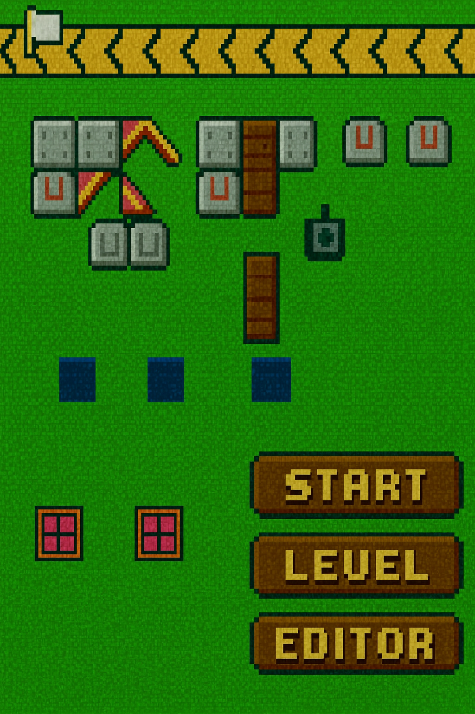
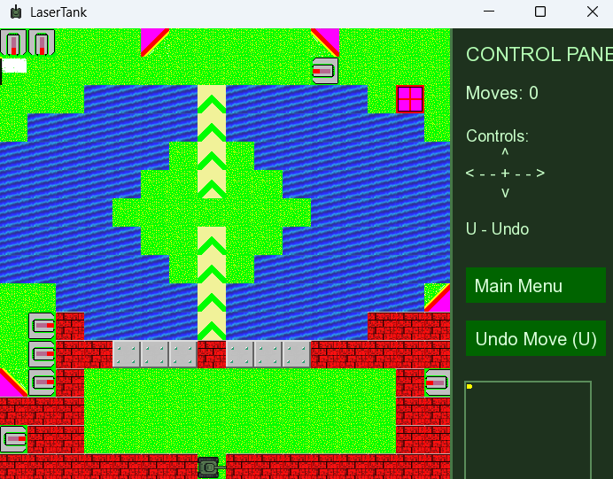

# Tank-Puzzle

**Tank-Puzzle** is a reinterpretation of the classic puzzle game *LaserTank*, fully written in **C++** with **SFML 2.6.2**.  
The goal is simple: navigate your tank through challenging levels, avoid obstacles, use mirrors to redirect your laser, and reach the finish tile.  
Behind this simplicity hides a deep strategic puzzle system with undo mechanics, movable blocks, enemy tanks, and diverse terrain types.

This project was created for learning, experimentation, and fun - while carefully improving the visuals and gameplay experience of the original.

---

## Build Instructions
Windows (MinGW, static SFML build)

This is a 32-bit build, so you need a 32-bit MinGW-w64 toolchain. You can confirm the target with:

gcc -dumpmachine

It should report an i686 target, for example i686-w64-mingw32.

You do not need to install or download SFML or libcurl yourself. On the first build the Makefile detects your system, downloads SFML 2.6.2 from the official site and libcurl from the project release page, and copies the required runtime DLLs next to the executable.

Clone the repository:

git clone https://github.com/DachoCyber/Tank-Puzzle.git

Build the game:

mingw32-make

Run it:

mingw32-make run

Clean the build:

mingw32-make clean

The first build takes a bit longer because it downloads SFML, which is about 18 MB. Later builds reuse the libraries that were already downloaded.

## Main Menu
Below is a preview of the main menu, redesigned in a retro-pixel style:

---

## Example Level

Here is a sample level demonstrating movement tracks, water tiles, mirrors, bricks, and multiple tanks:

# Features

# Gameplay
- Fully functional **tank movement system**  
- **Laser firing & bouncing** using 4 types of mirrors  
- **Movable blocks** that interact with bullets  
- **Enemy tanks** that can be destroyed  
- **Water, grass, bricks, tracks, flags**, and more  
- **Undo system (U key)** capable of restoring:
  - tank position  
  - block movement  
  - bullet state  
  - full map state  

### Level System
- Loads `.tmx` maps (Tiled Editor)  
- Level selector with preview  
- Built-in **Level Editor**

###  Graphics
- Custom **pixel-art tile set**  
- Retro UI elements  
- Smooth scaling with SFML  
- Distinct visual appearance for each block type

###  Audio
- Mirror bounce sound  
- Brick hit sound  
- Game Over sound (`game-over.mp3`)  
- Ambient and interaction effects using SFML Audio

# Engine Architecture
- Classes:
  - `MainGame`, `Map`, `Player`, `Bullet`, `BulletInteraction` etc  
- Clean separation of:
  - Player interaction  
  - Bullet physics  
  - Tile logic  
  - Rendering  
- Cross-platform build system:
  - Windows (MinGW / MSVC)  
  - Linux (GCC / Clang)  
